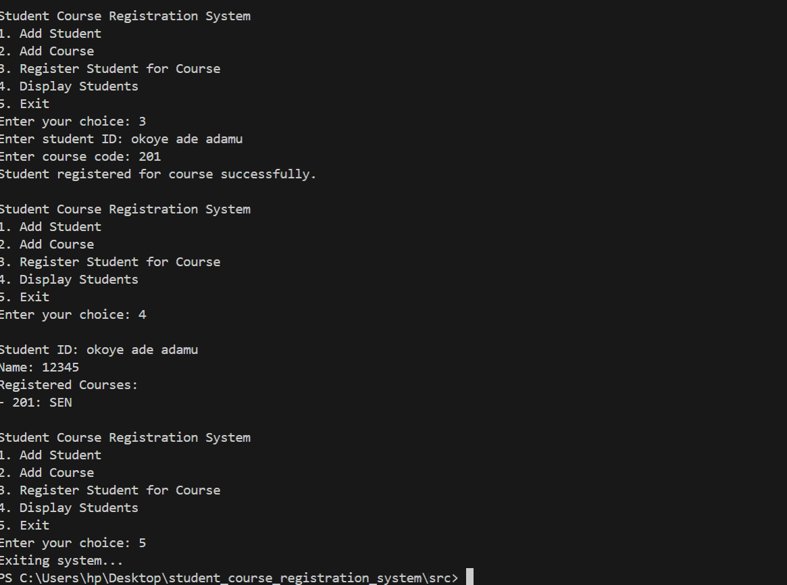
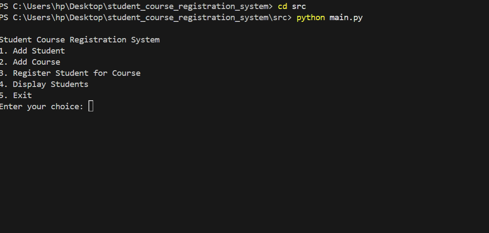
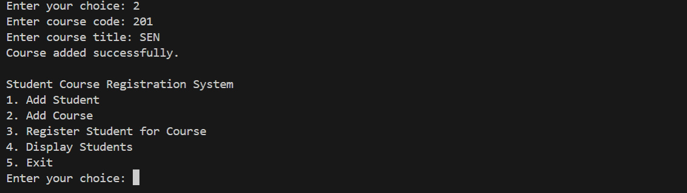
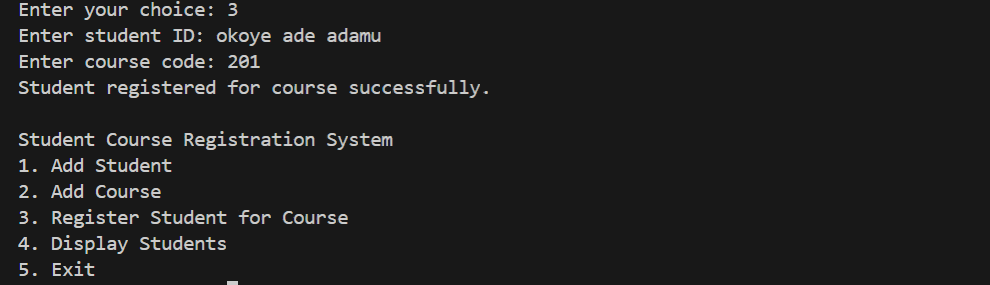
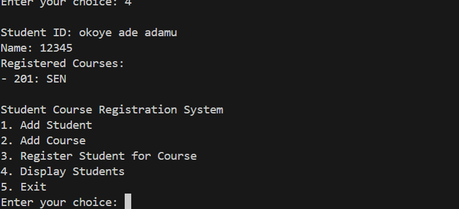

# Student Course Registration System

## Author
**Amalokwu Emmanuel Ubachukwu**  
Matric No: 24/14086  
Department: Computer Science  

## Course
SEN 201 – Software Engineering


## Project Overview
This project is a simple **Student Course Registration System** developed using **Python**.  
It allows students to be added, courses to be created, students to register for courses, and registered students to be displayed.

The project demonstrates the full **Software Development Life Cycle (SDLC)** as required in SEN 201.

---

## Software Development Life Cycle (SDLC)

### 1. Requirement Analysis
The system is required to:
- Add students
- Add courses
- Register students for courses
- Display registered students
- Be menu-driven and user-friendly

---

### 2. System Design
The system is designed as a **console-based application** using Python.
Key components include:
- Student data storage (in-memory)
- Course data storage
- Registration logic
- Menu-driven control flow

---

### 3. Implementation
The system was implemented using:
- Python programming language
- Functions for modularity
- Dictionaries and lists for data storage

Main file:
- `main.py`

---

### 4. Testing
The system was tested by:
- Adding students
- Adding courses
- Registering students for courses
- Displaying registered students

Screenshots below show successful execution.

---

### 5. Deployment
The project is deployed using **GitHub**.
The repository contains:
- Source code
- Documentation
- Execution screenshots

---

### 6. Maintenance
The system can be improved by:
- Adding file-based or database storage
- Implementing user authentication
- Creating a graphical interface

---

## Screenshots

### System Overview


### Main Menu


### Add Course


### Register Student for Course


### Display Registered Students


---

## How to Run the Project

1. Clone the repository
2. Navigate to the `src` folder
3. Run the program:
```bash
python main.py

